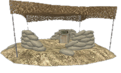
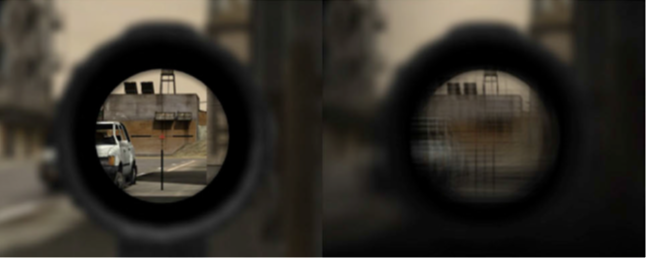
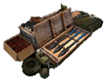
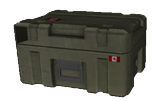
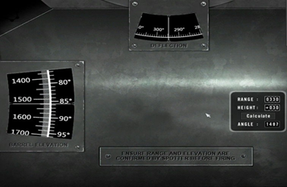
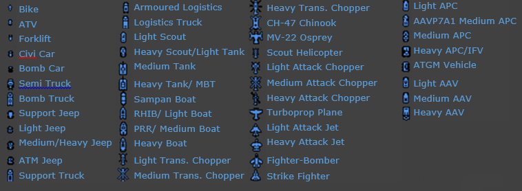

# README

Am wichtigsten ist, dass du  **einem Squad**  beitreten solltest. Einige Server erzwingen das sogar, indem sie Solospieler nach einer Warnperiode treten. Das Spiel macht bei weitem den meisten Spaß in einem funktionierenden Kader. Wenn Sie Hilfe brauchen, fragen Sie einfach die Spieler in Ihrem Squad \*\*, was zu tun ist. Wenn möglich, benutze Mumble. Es wird häufig in PR verwendet. Playing PR: BF2 ohne Mikrofon bietet nicht die volle Erfahrung, also ist es eine kluge Investition. Wenn niemand antwortet, versuche einem anderen Team beizutreten oder nutze den allgemeinen Chat. Es gibt viele helfende Gemeindemitglieder, die neue Spieler willkommen heißen und sie unterstützen. Wir erwarten von Ihnen, dass Sie ein grundlegendes Verständnis von BF2 haben, wenn es um das Navigieren im Spiel geht, wie Anzeigetafel, Karte und Kit-Auswahl. Sie können BF2 immer starten und das Tutorial dort machen, um sich mit seiner Oberfläche vertraut zu machen. Dieses Handbuch konzentriert sich auf die Unterschiede zu BF2.

## _Kit Auswahl & spawning_ {#kit-auswahl-und-spawning}

* Wenn du anfängst zu spielen, wird empfohlen, dass du nur als Schütze mit einem Visier deiner Wahl spawnst. Auf diese Weise kanst Du die grundlegenden Grundlagen des Gameplays besser erlernen.
* Nachdem du die Grundlagen der Infanterie gelernt hast, kannst du deinen SL bitten, dir ein spezielles Kit zuzuweisen, wenn du der Aufgabe gewachsen bist. Wenn Sie neue Ausrüstung oder ein Fahrzeug ausprobieren möchten, können Sie dies einfach im Koop-Modus tun, ohne die Mitglieder Ihres Teams zu belästigen oder das Vermögen Ihres Teams zu gefährden.
* Kits, die spezialisiert und schwieriger zu bedienen sind, sind in der Regel begrenzt und können nur erreicht werden, wenn bestimmte Bedingungen innerhalb eines Trupps erfüllt werden. Diese reservierten Kits sind für das Team begrenzt und Sie sollten immer nachfragen, bevor Sie eine anfordern.
* Kits können vom Haupt-Spawn-Menü \(wie BF2\), einer Lieferkiste [_\(siehe Logistik\)_](the_basics.md#Logistik) oder der Rückseite eines APC/IFV angefordert werden. Um die Möglichkeit zu haben, einen Bausatz aus einer Vorratskiste oder einem Fahrzeug anzufordern, müssen Sie Teil eines Trupps sein.

In PR: BF2 kannst du nicht an jedem Kontrollpunkt, den dein Team kontrolliert, spawnen. Spawn Punkte verfügbar in PR: BF2 sind:

*  **Der Sammelpunkt deines Trupps \(RP\)**  ist ein grüner Kreis, der einen Spawnpunkt mit der Nummer deines Trupps umgibt. Abhängig von der Position des RP deines Teams in Bezug auf den FOB eines Teams wird seine Langlebigkeit bestimmen. Hinweis: Wenn du am Sammelpunkt eines anderen Squads spawnt, spawnt du automatisch an deinem eigenen Sammelpunkt oder in der Nähe eines FOB. Wenn keine verfügbar sind, werden Sie in die Hauptbasis Ihres Teams versetzt. Wenn der Feind vom Feind überrannt wird, verschwindet seine RP. RPs sind nur für konventionelle Streitkräfte verfügbar. [\(siehe Deployable Structures\)](the_squad_leader.md#Rallyepunkte)

> 
>
> Ein Rallypunkt.

*  **Kartenspezifische Team-Sammelpunkte** . Diese enden in der Regel 5 Minuten nach Beginn der Runde und können vom gesamten Team genutzt werden. Diese erlauben auch nur maximal 12 Personen, bis sie verschwinden.
*  **Der Kommandeur-Sammelpunkt** . Diese RP kann nur vom Kommandanten platziert werden, vorausgesetzt, mehrere Gruppenführer sind in der Nähe des CO. Auf der Karte wird dies ein Sammelpunkt mit einem "C" daneben sein.
*  **Feld Operations Basis \(FOB\) oder Verstecke**  können vom gesamten Team verwendet werden, um zu spawnen, muss aber konstruiert werden, bevor es einsatzbereit ist. Auf der Karte wird es als Spawnpunkt mit einem grünen Dreieck angezeigt. Es kommt 90 Sekunden nach dem Aufbau online. Es wird für 30 Sekunden unspähbar, wenn 1 Gegner innerhalb von 10 Metern, 2 Feinde innerhalb von 50 Metern, 4 Feinde innerhalb von 100 Metern oder 8 Feinde innerhalb von 150 Metern sind. [\(siehe Aufbaubare Strukture\)](the_squad_leader.md#deployable-structures)
* Im Aufstand-Spielmodus kann das verteidigende Aufständische-Team in den  **Waffen-Caches**  spawnen, die dem Feind nicht aufgedeckt wurden, dies wird als unbekannter Cache bezeichnet. Dieser Spawn ist auch deaktiviert, wenn Gegner ähnlich wie der FOB geschlossen werden.

> 
>
> FOB, Versteck & Waffen Cache.

*  **Hauptquartier, Hauptbasis oder permanenter FOB Ihres Teams**  Dies ist der einzige Spawnpunkt, der immer verfügbar ist.

> 
>
> Armored Command Vehicle  \(ACV \) nur in Hauptbasen gefunden.

* Einige Karten verfügen über  **Fallschirm-Spawns** , in denen ein Luftangriff simuliert wird. Diese werden sichtbar gemacht, indem Spawn-Marker auf der Minikarte bewegt werden. Wählen Sie einen und vergessen Sie nicht,  **drücken Sie 9, um den Fallschirm zu entfalten** !

## _In-game interface  \(HUD \)_  {#hud}

* In der PR: BF2-HUD im Spiel werden die Spieler durch  **Spieler-spezifische Nachrichten**  benachrichtigt, die nur von diesem Spieler gesehen werden können. Sie werden verwendet, um Spielern Feedback zu verschiedenen Ereignissen im Spiel zu geben, zum Beispiel:
* Der Grund, warum der Spieler das Kit nicht angefordert hat, wurde angefordert.
* Der Grund, warum das bereitstellbare Asset, das der Player angefordert hat, nicht erstellt werden konnte.
* Der Spieler muss das Fahrzeug oder den aktuellen Sitz verlassen, um eine Bestrafung zu vermeiden.
* PR verwendet auch  **HQ-Benachrichtigungen** , die oben links auf dem Bildschirm als großer orangefarbener Typ angezeigt werden. Diese Benachrichtigungen informieren Sie über die aktuellen Ziele, den Fortschritt der Mission und andere wichtige Nachrichten.
* Feuern  **Fadenkreuz**  wurde vom Bildschirm entfernt. Wenn du genau schießen willst, musst du die alternative Schusstaste drücken, um auf die Visierung deiner Waffe zu zielen, oder die Keys für Nahkampf benutzen  \(siehe Waffenkapitel \).
*  **Namens-Tags wurden für alle Spieler**  entfernt. Es ist wichtig, dass Sie Ihre Ziele vor dem Einsatz identifizieren, um Freundschaftsfeuer zu vermeiden. Das Erlernen der Unterscheidung von verschiedenen Tarnfarben, Flaggen und der Profilform der Infanterie der Fraktionen hilft dir, einen Feind schneller zu identifizieren. Um beispielsweise einen Squad Leader zu finden, suchen Sie nach einer Radioantenne, die sich von seinem Rucksack nach oben erstreckt.
*  **Keine Gesundheitsstatusleiste**  zeigt Ihren Vitalstatus an. Wenn Sie mehr als 25% Ihrer Gesundheit verlieren, werden Sie einen roten blutigen Bildschirm sehen, der pulsiert,  Schmerzenschrei sind zu hören. Sie werden weiterhin an Gesundheit verlieren, wenn Sie ausbluten, bis Sie medizinische Versorgung erhalten, wenn Sie nicht sterben. Wenn Ihre Gesundheit jedoch sehr niedrig ist, wird Ihr Bildschirm alle Farben verlieren, Ihre Sicht wird sehr verschwommen und Sie werden sich nicht mehr schnell bewegen können. Sie werden ungefähr ein paar Minuten Zeit haben, um medizinische Hilfe zu bekommen, oder Sie werden sterben.
*  **Der Munitionszähler**  zeigt nur den Feuermodus der Waffe und die Anzahl der verbleibenden Magazine an.
* Um die  **Anzahl verbleibender Runden**  in deinem Magazin zu schätzen, kannst du die Kommunikationsrose  \( **Q**  \) festhalten und einen visuellen Indikator für die verbleibende Munitionsmenge sehen. 
*  **Der Medic**  kann sehen, wie weit er fertig ist, um einen Soldaten mit dem HUD in der unteren rechten Ecke zu heilen. Die Infanterie kann das gleiche beobachten, wie lange es dauert bis das Schaufeln fertig ist.
* Es gibt keine Kill-Nachrichten \*\* \(Friendly Fire ist eine Ausnahme\). Selbst die Anzeigetafel zeigt nicht an, wer im gegnerischen Team lebt oder tot ist. Wenn du wissen musst, ob jemand tot ist, solltest du nach seinem Körper suchen.
* Nur Fahrzeuge verwenden eine permanente  **Minikarte**  auf dem HUD. Das vollständige Karten-Overlay ist für jeden verfügbar.
*  **Die aktuelle Karte und Ebene**  kann beim Öffnen der Karte oben auf dem Bildschirm angezeigt werden.
* Mit dem kleinen Pfeil wird das  **aktuelle Karten-Asset-Info-Overlay**  aller Fahrzeuge auf der Karte angezeigt, einschließlich der Spawn-Zeiten von befreundeten Fahrzeugen.

> 
>
> Aktuelles Karten-Asset-Info-Overlay.

*  **Die Restkarten**  Ihres Teams und die verbleibende Zeit können nur vom Gruppenbildschirm aus gesehen werden. Die gegnerischen Tickets werden nicht angezeigt.
*  **Unterdrückung**  passiert, wenn Sie von Gewehren, schweren Waffen oder Explosionen in der Nähe unter Beschuss genommen werden. Der Bildschirm wird dunkler und verschwommen, wenn er zittert. Dieser Effekt simuliert die reduzierte Fähigkeit, effektives Feuer zurückzugeben, während er vom Gegner unterdrückt wird.

> 
>
> normale Ansicht des Spiels  \(links \) und Unterdrückungsseffekt in Aktion  \(rechts \).

* Wenn ein Spieler  **tot ist,**  wird er nicht wiederbelebbar sein und ein schwarzer Bildschirm mit den Worten tot wird angezeigt, anstatt seine Umgebung zu sehen.
* Ihre Waffe wird abweichen und wird basierend auf der Menge an Bewegung, die Sie ausführen, ungenau schießen. Um einen Hinweis auf diese Ungenauigkeit zu erhalten, gibt es einen  **Abweichungsindikator**  direkt über dem Kompass. Je breiter dieser Indikator ist, desto mehr Abweichung haben Sie.
*  **Das automatische Kartensuchsystem**  wurde von der Infanterie entfernt. Luftfahrzeuge können immer noch entdeckt werden.
* Offiziere können einen  **Kontakt**  -Bericht an den Kommandanten senden oder ihr Radio benutzen, um manuell einen Marker auf die Karte des Teams zu setzen. Normale Soldaten können nur dann eine allgemeine Warnung rufen, wenn sie feindliche Einheiten entdecken.
*  **Die Haupt-Funkkommunikationsrose  \(Standard: Q & T \)**  enthält Elemente mit zwei Funktionen. Mit einem Linksklick  **"Nachlaaden / Feuer einstellen"**  erzählst du den Leuten um dich herum, dass du die Magazine wechselst, während ein Rechtsklick ihnen sagt, dass sie aufhören sollen zu schießen. Das gleiche Prinzip gilt für  **Los los los / Zurückziehen**  und andere solche Menüpunkte.
* Sie können sich \*\* auf der Karte orientieren, indem Sie das Richtungselement verwenden, das Sie um Ihr Player-Symbol finden.
* Bei Ausstattung mit bestimmten Waffen oder Ausrüstungsgegenständen wird die Haupt-Funkkommunikationsrose \*\* durch ein kleines kontextsensitives Menü ersetzt. Wenn du ein Felddressing oder die Medic-Bag hältst, kannst du den "FIRST AID" -Befehl benutzen, um Spieler in der Nähe zu informieren, dass du sie heilen willst. Viele Ausrüstungsgegenstände und einige Waffen verwenden kontextsensitive Menüs.

> 
>
> Commo-Rose beim Drücken von Q.

## _Gesundheitsmanagement_ {#Gesundheitsmanagement}

Waffen in Project Reality sind sehr tödlich und es ist nur eine Frage der Zeit, bis du angeschossen wirst und zu bluten anfängst. Obwohl das HUD in PR keinen Gesundheitsbalken enthält, wird es, sobald Ihr Gesundheitszustand unter 75% fällt, akustische und visuelle Hinweise geben, die Dich warnen, wie zum Beispiel eine blutige Vision beim Husten oder Schreien.

heilen

Wenn Ihre Verletzungen nicht behandelt werden, werden Sie langsam verbluten. Um dies zu verhindern, hast du zwei Möglichkeiten, dich selbst zu heilen. Beinahe jedes Kit enthält ein  **Feldverband** , das durch Drücken der entsprechenden Taste oder durch die Auswahl der Waffe ausgewählt wird. Drückendes Feuer wirft es auf den Boden. Innerhalb von ein oder zwei Sekunden verschwindet der Feldverband und der Spieler, der daneben steht, erhält 25% seines gesamten Gesundheitszustands wieder.

Da die meisten Kits nur ein oder zwei Feldverbände haben, ist ein besserer Weg, um wieder gesund zu werden, von einem Sanitäter zu behandeln.  **Medics**  können einen Spieler komplett heilen, indem sie ein  **Erste-Hilfe-Set**  benutzen und können zu deiner Position gerufen werden, indem du den "Q" Radio-Schlüssel benutzt und dann "S A N I" auswählst. Der Sanitäter wählt den Erste-Hilfe-Kasten aus, indem er die entsprechende Zifferntaste drückt oder seine Waffenauswahl durchläuft. Im Gegensatz zu BF2 kann der Sanitäter das Erste-Hilfe-Set jedoch nicht einfach auf den Boden werfen, sondern muss es in den Händen halten, den zu heilenden Spieler berühren und dann die linke Maustaste gedrückt halten. Eine Klangsimulation lässt erkennen, dass die erste Hilfe angewendet wird. Um vollständig geheilt zu werden dauert es ungefähr 15 Sekunden, also solltest du dies an einem sicheren Ort tun.

 **Wiederbelebung** 

Wenn du nicht rechtzeitig geheilt werden kannst, wirst du bewusstlos und der Bildschirm wird dir sagen, dass du schwer verletzt wurdest. Das bedeutet nicht, dass du tot bist! Wenn Sie schwer verletzt werden, kann ein Sanitäter Sie bis zu 5 Minuten lang wiederbeleben und Ihrem Team wertvolle Tickets ersparen. Sie können Mumble verwenden, um den Sanitäter mit Ihrem Standort zu koordinieren, indem Sie den lokalen Kanal  \(H \) oder  **das Radio-Net  \( Numpad \) des Trupps verwenden.** Um Sie wiederzubeleben, wählen Sie den  **epipen**  aus der Waffenauswahl aus und injizieren und verabreichen Sie den Adrenalinschuss durch Klicken und Halten der linken Maustaste in den zentralen Massenbereich des Rumpfes des bewusstlosen Spielers. Der Spieler wird dann bewusst, aber anders als in BF2, wird nur bei etwa 10% Gesundheit und wird immer noch Heilung benötigen. Der Sanitäter und der kürzlich wiederbelebte Spieler sollten einen sicheren Bereich finden und dort den Heilungsprozess fortsetzen. Wenn der Spieler steckengeblieben ist \(in einer Mauer, Baum usw.\) oder auf einem unebenen Boden \(Berghang\), kann es helfen, den Körper zuerst durch Herzmassage wiederzubeleben. Dadurch wird der Körper bewegt und er kann sich nicht mehr festsetzen.

> 
>
> Feldverband, Erste-Hilfe-Kit & Epipen.

 **Tod** 

Manchmal werden Spieler nicht wiederbelebt, zum Beispiel wenn ein Spieler in einem Fahrzeug getötet wird. Wenn du vor kurzem wiederbelebt wurdest und innerhalb von 2 Minuten wieder kritisch verletzt wirst, wirst du das zweite Mal nicht wiederbelebt werden. Wenn du verletzt bist und nicht innerhalb von 5 Minuten wiederbelebt wirst, wirst du auch tot sein. Wenn es keine Chance gibt, wiederbelebt zu werden, klicken Sie im Spawn-Bildschirm mit der linken Maustaste auf  **Aufgeben / Sanitäter** . Jetzt wird auf dem Bildschirm angezeigt, dass du tot bist und du kannst dich auf Respawn vorbereiten. Die Zeit, die du damit verbracht hast auf das Klicken zu warten, zählt auf Deine gesamte Respawnzeit.

 **Re-Spawn** 

Die Respawn-Zeit eines Spielers beträgt mindestens 45 Sekunden und höchstens 60 Sekunden plus temporäre Strafen. Die Zeit, die während des Wartens auf einen Arzt verstrichen ist, wird von dieser Zeit abgezogen. Sobald ein Spieler stirbt, muss er mindestens 5 Sekunden warten, bevor er spawnt. Diese Aktionen beeinflussen die Respawn-Zeit:

* Spieler Tod:  **+ 3s** 
* Capturing CP oder Ziel zu zerstören:  **- 3s** 
* Eine defensive Aktion:  **- 1s** 
* Squad baute Vorposten auf:  **- 10s** 

Eine vorübergehende Spawn-Zeit-Strafe, die nur das nächste Mal betroffen ist  \(bis zu 5 Minuten \) wird durch folgende Aktionen hinzugefügt:

* Teamkill:  **15 Sekunden pro Teamkill** 
* Selbstmord:  **15 Sekunden** 
* Zivilist wird gefangen:  **90 Sekunden** 
* Zivilist getötet Verletzung der ROE:  **120 Sekunden pro Zivilisten** 
* Eigener Waffencache zerstört:  **300 Sekunden** 

Um einen Spawn-Punkt auszuwählen, rufen Sie die Spawn-Map auf und wählen Sie einen geeigneten Ort. Sobald Sie mit diesem Spawn-Ort zufrieden sind, müssen Sie auf die  **Fertig**  -Schaltfläche in der unteren rechten Ecke des Kartenbildschirms klicken, um in das Spiel zurückzukehren. Nur zu warten bis der Timer ablaufen ist und die Enter Taste zu drücken, bringt Sie nicht zurück ins Spiel. Wenn auf dem Timer eine sehr große Zahl angezeigt wird, z. B. 5999, haben Sie nicht auf Fertig geklickt.

## _Logistik_ {#Logistik}

Egal, ob Sie nur wenig Munition haben und sich neu bewaffnen müssen, ein neues Kit benötigen oder einfach nur Bereitstellungen erstellen möchten, die Logistik hält Ihr Team am Leben.

### _Munition_ {#munition}

Um sich wieder auffüllen zu können, müssen Sie sich einer Munitionsquelle nähern, die Ihre Waffen automatisch wieder füllt. Diese Quellen sind:

*  **Munitionstaschen**  - Diese können in den Schützen-, Militanten-, Krieger- und einigen Aufstands-Kits gefunden werden und müssen auf den Boden geworfen werden, damit du oder andere Soldaten wieder aufsetzen kannst oder auf Einsatzkräfte \(tow, aa, Mörser\), um sie wieder aufzurichten.
*  **Ammo-Boxen**  - abgesetzt von leichten transportierten Fahrzeugen, APCs und IFVs.
*  **Leichte / schwere Vorratskisten**  - Weitere Informationen im [nächsten Abschnitt](https://github.com/realitymod/pr-manual/tree/4ed281e1ffdb0845e74555f5cada93e3d9bb1c53/de/the_basics/the_basics/README.md#crates)
*  **Waffencaches**  - Nur für Aufständische verfügbar
*  **Fahrzeugdepot**  - In allen Hauptbasen vorhanden, heilt es auch Sie

&lt; &gt;

> Munitionstasche, Munitionskiste der Koalitionskräfte, Munitionskiste der Aufständischenkräfte, Waffencache & Fahrzeugdepot.

Beachten Sie, dass mit Ausnahme von  **Waffencaches**  und  **Fahrzeugdepot**  alle anderen Munitionsquellen  **begrenzt sind** . Irgendwann werden diese Quellen verschwinden und verschwinden.

> Es ist sogar möglich, dass die Munitionsquellen erschöpft sind, bevor Sie vollständig rearmiert wurden.

Eine andere Sache zu beachten ist, dass die Nachlieferung ist  **nicht sofort** , sondern dauert ein paar Sekunden, abhängig von der Munitionsquelle sowie mit der Menge an Munition, die Sie brauchen, um sich zu versorgen. Auch wenn du nicht aufrüstst, verifiziere außerdem, dass die Light / Heavy-Versorgungskisten in deinem Teambesitz sind. Eine Wiederbewaffnung von \*\* gegnerischen Vorratskisten ist nicht möglich.

### _Vorrats-Kisten_ {#Kisten}

Es gibt zwei Arten von Versorgungskisten in PR: BF2 - Light Supply Crate und Heave Supply Crate. Während beide es erlauben, Spieler zu versorgen und Stellungen zu bauen, entspricht eine leichte Kiste der Hälfte der schweren Vorratskiste, was bedeutet, dass du 2x leichte Vorratskisten brauchst, wo nur 1x schwere Vorratskiste benötigt wird. Weitere Informationen zu Aufbauen von Stellungen finden Sie im Kapitel. [Deployable Structures](https://github.com/realitymod/pr-manual/tree/4ed281e1ffdb0845e74555f5cada93e3d9bb1c53/de/the_basics/Aufbaubare-Strukturen_squad_leader/README.md)

> 
>
> _Hier sehen Sie die schwere Vorratskiste links und die leichte Version rechts._

Genau wie beim Wiederbewaffnen wird das Anfordern von Kits aus Kisten die Vorratskisten verbrauchen. Jedes Kit kostet 200 Punkte, mit leichten Kisten 1500 \(7x Kits\) und schweren 3000 \(14x Kits\).

> Wenn Sie Kits von einer Kiste anfordern, die nicht genug Punkte hat, erhalten Sie immer noch das Kit, aber die Kiste wird dabei zerstört.

leichte Vorratskisten können transportiert werden durch:

* Leichte Helikopter wie der Huey, Lynx und Zhi-9B \(eine Kiste\)
* Transportwagen \(eine Kiste\)

Während schwere Vorratskisten transportiert werden durch:

* Mittlere Lifthubschrauber wie der Black Hawk, Mi-17 und NH-90 \(eine Kiste\)
* Heavy Lift Helicopters wie der Chinook, Zhi-8KA und MV-22 \(Zwei Kisten\)
* Logistik-LKW: \(Zwei Kisten\)

Der Besitzer der Kiste wird durch die Flaggenanzeige auf der Kiste dargestellt.

### Reparatur absetzen

Logistik-LKWs haben auch die Möglichkeit, eine Reparaturstation abzusetzen. Sie sind für die Reparatur von Fahrzeugen vor Ort erforderlich, die stark beschädigt sind und sich nicht bewegen können.

> 
>
> Reparatur absetzen.

## ­_score_ {#Punkten}

Die Punktzahl eines Spielers wird in Teamarbeitspunkte und einzelne Punkte geteilt. Es spricht für sich selbst, dass Team-bezogene Aktivitäten \(Bauen, Fahren von Fahrzeugen, Verteidigen / Angreifen von Flaggen\) zu den ersten und individuellen Aktionen beitragen, die zu Ihrem persönlichen Ergebnis beitragen.

Die Gesamtpunktzahl eines Spielers darf nie unter 0 fallen, aber die Teamarbeit kann negativ werden. Es gibt auch Score-Multiplikatoren für wenn Sie zum Beispiel in einem Fahrzeug oder einem Gruppenführer sind. Hier sind einige weitere Ergänzungen und Abzüge. Dies sind nicht alle, aber geben Ihnen eine gute Idee, was Sie erreichen können.

* Einen Zivilisten gefangennehmen:  **+ 100** 
* Töten einer Zivilperson  \(außerhalb ROE \):  **- 100** 
* Zerstöre dein eigenes Ziel:  **- 100** 
* Zerstörendes feindliches Ziel:  **+ 150** 

## _Mörser_ {#mörser}

Eine feste Mörserposition, die eine indirekte Feuerunterstützung über große Entfernungen bieten kann. Alle Fraktionen können hochexplosive Munition abfeuern. Konventionelle Streitkräfte und die Miliz können auch Airburst- und Rauchgranaten einsetzen. Mörser können nicht auf Karten kleiner als 2km gebaut werden.

*  **Hochexplosiv  \(HE \)**   \(drücke  **1** , um  auszuwählen\): Häufigste Art von Mörsergeschossen. Schadet am meisten direkt dem Ziel. Ideal für leichte gepanzerte Ziele und Stellungen.
*  **Airburst**   \(drücke  **2** , um \) auszuwählen: Explodiert in der Luft über dem Boden. Deckt eine größere Fläche ab, verursacht aber insgesamt weniger Schäden. Ideal für Infanterie in Gebäuden und auf unebenem Gelände.
*  **Nebel/Rauchgranate**   \(drücke  **3** , um \) auszuwählen: Vernebelt das Gelände und bietet einen Vorteil für einrückende Infanterieeinheiten. Kann auch benutzt werden um den Gegner in seiner Sicht zu behindern und die eigene Mörserstellung zu sichern

Sobald Mörser benötigt werden, können Sie den Mörserrechner verwenden \(drücken Sie  **4** , um  auszuwählen\). Die Entfernung zum Ziel und die Höhendifferenz können in den Rechner eingegeben werden, indem Sie auf die Zahlen in den Feldern  **"Bereich"**  und  **"Höhe"**  klicken. Um die Reichweite zu erhalten, stelle sicher, dass sich SLs Marker auf dem Ziel befindet, dann öffne die Karte und du findest den Bereich unter der Karte. Wenn Sie fertig sind, klicken Sie einfach auf die Schaltfläche  **"Calculate"** , um die erforderliche Lauf-Höhe anzuzeigen. Die Höhe kann mit den Tasten W und S eingestellt werden, während die Auslenkung mit den Tasten A und D geändert wird. Wenn beide Werte eingestellt sind, wählen Sie einfach die gewünschten Runden aus und feuern Sie ab. Es gibt sowohl Air-Burst- als auch Impact-Runden, die Munition teilen.

> 
>
> Die Mörserrechner-Schnittstelle.\_

## _Ponton Brücken \(CSB\)_ {#ponton-brücken}

Wenn konventionelle Streitkräfte kleine Flüsse oder beschädigte Brücken überqueren müssen, können sie CSBs mit ihren Logistikfahrzeugen einsetzen, von denen zwei transportiert werden. In Project Reality können CSBs nur dazu verwendet werden, die Lücken zerstörter Brücken und an vorbestimmten Orten zu füllen, die durch \(offensichtliche\) kleine Sandhaufen identifiziert werden, die über ein natürliches Hindernis, wie einen Fluss, positioniert sind.

> CSBs sind sehr eng, fahren Sie vorsichtig, wenn Sie sie überqueren.

Der Bereitstellungsprozess für CSBs ist sehr einfach:

1 Fahren Sie mit einem Logistik-Lkw an die Stelle, an der der CSB eingesetzt werden soll.

2 Positionieren Sie die Vorder- oder Rückseite so nah wie möglich an der Einsatzposition.

1. Wählen Sie den CSB als aktive Ausrüstung des LKW aus.

4 Drücken Sie alternatives Feuer, um die Brücke zu aktivieren.

In einigen Fällen müssen mehrere CSBs die gesamte Entfernung überspannen. In solchen Situationen müssen Sie bis zum Ende der unvollständigen Brücke fahren und einen neuen CSB bereitstellen und bis zum Ende wiederholen.

> 
>
> CSB vom LKW wird eingesetzt.

{% embed data="{\"url\":\"https://www.youtube.com/watch?v=Vn66KbNrVJA\",\"type\":\"video\",\"title\":\"\",\"icon\":{\"type\":\"icon\",\"url\":\"https://www.youtube.com/yts/img/favicon\_144-vfliLAfaB.png\",\"width\":144,\"height\":144,\"aspectRatio\":1},\"thumbnail\":{\"type\":\"thumbnail\",\"url\":\"https://i.ytimg.com/vi/Vn66KbNrVJA/maxresdefault.jpg\",\"width\":1280,\"height\":720,\"aspectRatio\":0.5625},\"embed\":{\"type\":\"player\",\"url\":\"https://www.youtube.com/embed/Vn66KbNrVJA?rel=0&showinfo=0\",\"html\":\"
<iframe src=\\\"https://www.youtube.com/embed/Vn66KbNrVJA?rel=0&amp;showinfo=0\\\" style=\\\"border: 0; top: 0; left: 0; width: 100%; height: 100%; position: absolute;\\\" allowfullscreen scrolling=\\\"no\\\"></iframe>
\",\"aspectRatio\":1.7778}}" %}

## _Schlachtfeld Navigation_ {#Schlachtfeld-Navigation}

Es ist ziemlich einfach, sich auf den großen Karten von PR: BF2 zu verlieren. Die langsame Taktung und Teamkoordination erfordert auch, dass die Spieler Orte klar und prägnant kommunizieren. PR: BF2 bietet 4 Tools, um Spielern dabei zu helfen.

1 Squad Leader können ihren  **Squad Order Marker**  verwenden, um Orte an ihre Squad und den Commander zu kommunizieren. Die Richtung zum Marker wird durch einen Chevron über dem Kompass angezeigt. Wenn Sie sich nicht mehr als 75 Meter von der Markierung entfernt befinden, sehen Sie auch ein 3D-Symbol, das die Position vor Ihnen anzeigt. Der Marker wird auch auf der Karte sichtbar sein.

* **Ziel** 
* **Bauen** 
* **Beobachten** 
* **Verteidigen** 
* **Zerstören** 
* **Bewegen** 

2 Ein  **Präzisionsgradkompass**  zum unteren mittleren Bereich des Bildschirms. Der Kompass kann verwendet werden, um in der Nähe befindliche Feinde genau zu lokalisieren.  **Die 8 Kardinal Richtungen**  sind deutlich mit den Grad-Label gekennzeichnet, die schrittweise alle 15 ° mit großen Abschnitten alle 5 ° dargestellt sind. Wenn Sie nur eine allgemeine Richtung mitteilen möchten, ist es am besten, die Himmelsrichtung zu sagen, gefolgt vom Grad und in manchen Fällen auch von der Entfernung. Zum Beispiel \_  **"Feind entdeckt NE 75 ° Grad 200 Meter außerhalb"** .\*\*

* Wenn das Ziel visuell mit einer nummerierten Peilung auf Ihrem Kompass übereinstimmt, wenn Sie in diese Richtung zeigen, sagen Sie einfach diese Nummer.
* Denken Sie daran, dass alle großen Kompasskerben gleich 5 Grad sind. Wenn das Ziel mit einer Kerbe auf der rechten Seite einer beschrifteten Kerbe entlang von 75 ° übereinstimmt, dann fügen Sie 5 ° hinzu. Das Ziel liegt also bei 80 °.

1. Die Karten in PR: BF2 enthalten  **Raster-Referenzlabels und Tastatur-Subgrids** . Die Rasterbeschriftungen befinden sich am oberen und linken Rand der Karte. Die Karte ist in 169 Gitterquadrate unterteilt, beginnend mit A1 in der oberen linken Ecke und endend mit M13 in der unteren rechten Ecke. Jedes Rasterquadrat ist in 9 Teilraster unterteilt. Diese werden von 1 bis 9 auf die gleiche Weise wie ein Nummernblock eines Computers bezeichnet.  \(Obere Reihe von links nach rechts 7, 8, 9 \). Sie können Orte kommunizieren, indem Sie eine Rasterreferenz ausgeben. Für einen ungefähren Ort sagen Sie nur das Hauptrasterfeld  \(zB D6 \). Für genaue Orte fügen Sie auch das Untergitter ein  \(zB D6-2 \). Grid-Referenzen werden meist verwendet, um Standorte zwischen Trupps zu kommunizieren. Bei Verwendung von Mumble wird der erste Buchstabe der Grid-Referenz normalerweise mit dem phonetischen Alphabet der NATO angezeigt. Die Codewörter sind Alpha, Bravo, Charlie, Delta, Echo, Foxtrot, Golf, Hotel, Indien, Juliett, Kilo, Lima, Mike, November, Oscar, Papa, Quebec, Romeo, Sierra, Tango, Uniform, Victor, Whisky, X -Ray, Yankee und Zulu

4  **Die Größe jedes Quadrats**  wird in der unteren rechten Ecke der Karte angezeigt. Eine 1 km lange Karte wird von einem 75-m-Grid-Squad angezeigt, 150 m für 2 km und 300 m für eine 4 km-Karte. Mit den Gitterquadraten können Sie Entfernungen auf der Karte leicht schätzen. Der Kader-Bildschirm des Gruppenführers zeigt außerdem die ungefähre Entfernung zu Ihrem aktuellen Gruppenmarker unter der Karte des Schlachtfelds an.

## _Basis Fahrzeuginformationen_ {#Basis-Fahrzeuginformationen}

Viele Fahrzeuge verhalten sich im Vergleich zu BF2 sehr unterschiedlich und erfordern fortgeschrittenere Kenntnisse. Da sie auch sehr lange Spawnzeiten haben \(bis zu 20 Minuten\), ist es wichtig zu wissen, wie man sie von problematischen Situationen fernhält. Dieser Teil wird sich darauf konzentrieren, Fahrzeugtypen zu erklären und wie sie das Team beeinflussen. Weitere Informationen zum Betrieb von Fahrzeugen finden Sie in diesem Handbuch im Abschnitt Betriebsfahrzeuge.

Es gibt viele Fahrzeugtypen in PR: BF2 wird als Klassifizierung verwendet. Dies ist aus Gründen des Gameplays nicht immer direkt mit ihrem Real Life-Pendant vereinbar. Die folgende Liste zeigt Ihnen die wichtigsten Fahrzeugklassen in PR: BF2:

*  **Jeep:**  kleine Transportfahrzeuge, die nicht immer die gesamte Mannschaft füllen. Kann immer kleine Munitionskisten fallen lassen. Manchmal sind Maschinengewehre Nester ausgestattet.

*  **Zivilfahrzeuge:**  PR: Die Aufständischen der BF2 haben Zugang zu einer Reihe ziviler Autos und technischer Ausrüstung, die mit Maschinengewehren, Raketenpaketen und rückstoßfreien Gewehren SPG-9 ausgerüstet sind. Sie haben auch ein Flachbett mit einer angebrachten AA-Pistole, Bombenlastwagen und Bombenautos in ihrem Arsenal.

*  **Truck:**  kommen in Transport- und Logistikvarianten. Die Transportvariante ist in der Lage, 1 Leichte Kiste abzuwerfen und kann einen ganzen Trupp aufnehmen. Die logistische Variante kann nur 2 Soldaten aufnehmen und kann 2 schwere Vorratskisten, Reparaturstationen und geschlossene Unterstützungsbrücken ablegen \(mehr dazu später\).

*  **Gepanzerter Personentransporter  \(APC \):**  große gepanzerte Fahrzeuge, die oft mit schweren Waffen bewaffnet sind. Oft besitzen sie nicht die Kraft, andere schwere gepanzerte Ziele wie IFVs und Panzer zu besiegen, aber sie sind die besten aller Arten von Fahrzeugen zur Unterstützung der Infanterie. Kann 2 Besatzungsmitglieder \(Fahrer und Richtschütze \) und bis zu 6 Soldatenpassagiere aufnehmen.

*  **Infanterie-Gefechtsfahrzeug  \(IFV \):**  Besser bewaffnet und stärker als die meisten APCs mit oft Fähigkeiten, schwere gepanzerte Ziele mit AT-Raketen zu besiegen. Kann nicht immer Infanterie transportieren. Unter diese Kategorie fallen oft auch die Aufklärungsfahrzeuge.

*  **Panzerabwehrraketenfahrzeug  \(ATM \):**  Der Name spricht für sich. Dies sind Fahrzeuge, die mit AT-Raketen bewaffnet sind, um andere gepanzerte Fahrzeuge zu zerstören. Infanterie kann nicht transportiert werden.

*  **Tank:**  Unser schwerstes gepanzertes Fahrzeug. Sie sind mit AP-, HE- und COAX-Waffen ausgerüstet.

*  **Anti-Air Vehicle:**  Dies sind in der Regel leichte gepanzerte Fahrzeuge mit der Fähigkeit, feindliche Flugzeuge und Hubschrauber zu beseitigen. Sie können Raketen oder / und schwere Waffen verwenden.

*  **Boot:**  PR: BF2 hat eine Vielzahl von Booten sowohl bewaffnet als auch unbewaffnet.

*  **Transporthubschrauber:**  Diese Helikopter sind normalerweise mit TürMG für die eingestigene Infanterie ausgestattet.Sie können auch schwere Vorratskisten fallen lassen. Es gibt leichte, mittlere und schwere Transporthelis. Lesen Sie den Abschnitt Vorratskisten, um zu erfahren, welche Variante welche Kisten zur Verfügung hat.

*  **Attack Helicopters:**  Diese Hubschrauber sind mit Maschinengewehren und einer Vielzahl von Raketen ausgestattet. Es gibt leichte, mittlere und schwere Varianten. Recon Hubschrauber mit der Fähigkeit, Ziele zu lasern und ihre Wärmebildkameras zu verwenden fallen auch unter diese Kategorie in PR: BF2. Sie sind nicht immer bewaffnet.

*  **Jets:**  PR: BF2 hat eine große Auswahl an Jets. Es gibt leichte und schwere Kampfjets, Kampfjets, Bomber und Jagdbomber.

Alle befreundeten Fahrzeuge sind auf der Karte mit eindeutigen Symbolen zur einfachen Identifizierung gekennzeichnet.

* Wenn ein Team-Fahrzeug-Vermögenswert zerstört wird, entsteht eine Ticket-Strafe:
  * Jeep oder LKW:  **2 Tickets** 
  * Transporthubschrauber:  **5 Tickets** 
  * APC / AAV / RECON:  **5 Tickets** 
  * Tank oder IFV:  **10 Tickets** 
  * Jet oder Angriffshubschrauber:  **10 Tickets** 
* Fahrzeuge sind  **Team gebunden**  und du kannst keine gegnerischen Fahrzeuge jeglicher Art bedienen.
* Fahrzeuge können nur  **von geeigneten Positionen**  am Rumpf betreten werden.
* Normale Soldaten dürfen kleine ungepanzerte Fahrzeuge wie Jeeps, Lastwagen und Boote ohne spezielle Ausrüstung fahren. Wenn Sie  **ein Crewman oder Pilot Kit**  benötigen, um eine Fahrzeugposition zu bedienen, erhalten Sie bei der Eingabe eine Warnmeldung und der Bildschirm wird schwarz. Wenn Sie die Fahrzeugposition nicht innerhalb weniger Sekunden verlassen, werden Sie sterben.
* Wenn Sie  **ein fahrendes oder brennendes Fahrzeug**  verlassen, werden Sie verwundet und sterben möglicherweise. Je schneller sich das Fahrzeug bewegt, desto größer ist die Wahrscheinlichkeit des Todes.
*  **Das Zerstören von Fahrzeugwracks**  hat keinen Einfluss auf die Punktzahl, obwohl eine Warnmeldung bei der Zerstörung von freundlichen Wracks gezeigt wird.
* Wenn Sie  **stationäre oder Fahrzeugwaffen**  bemannen, dauert es eine bestimmte Zeit, bevor Sie schießen können:
  * MG:  **5 Sekunden** 
  * Flugabwehrrakete:  **5 Sekunden** 
  * AT-Aufbau:  **10 Sekunden** 
  * Armor Hauptkanone:  **30 Sekunden** 
* Die meisten stationären AT-Waffen haben eine Optik mit fester Zoomfunktion. Einige von ihnen bieten sogar thermische Optik an.
* Fahrzeuge, die in der Luft stehen und aus großer Höhe ins Wasser fallen, verletzen Sie und können zum Tod führen.
* Spieler können  **Kits**  von der APC / IFV-Startposition anfordern.
* Gepanzerte Fahrzeuge sind anfälliger, wenn sie von ihren Flanken angegriffen werden. Die Panzerung am Heck des Fahrzeugs ist am schwächsten. Ein einzelnes gut platziertes Panzerabwehrgeschoss kann sie deaktivieren oder ausschalten.

>  _Fahrzeug-Einstiegspunkte können sich je Fahrzeug unterscheiden. Suchen Sie nach Luken._

