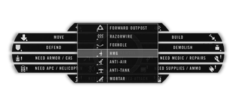
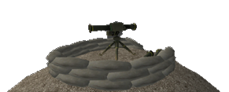
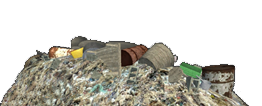

# ** Der Truppführer ** {#der-Truppführer}

 

## _Truppführung_ {#Truppführung}

 

Wie im Abschnitt "Schlachtfeld-Navigation" erklärt, kann der Squad-Leader Marker auf die Karte setzen, damit seine Squad-Mitglieder ihm folgen können. Sie werden einen Marker auf ihrem Kompass finden, um zu folgen, sowie ein Symbol auf der Karte. Der Squad Leader sollte diese so oft wie möglich benutzen und kann damit auch die Entfernung zu einem Ziel leicht erreichen. Er kann dies von der Minikarte aus tun, indem er mit der rechten Maustaste darauf klickt und den Marker platziert oder indem du die ** sekundäre Radiotaste \ (T \) ** drückst und auf das Ziel zeigst und einen der Knöpfe benutzt, um den Marker zu platzieren.

 

* ** Ziel **

* ** Bauen **

* ** Beobachten **

* ** Verteidigen **

* ** Zerstören **

* ** Bewegen **

 

Der Kommandant kann Sie auch befehlen. Wenn Sie den Befehl akzeptieren (** PAGE UP ** \), wird Ihr Marker durch den Befehl des Kommandanten ersetzt.

 

## _Feindsichtung_ {#sichtung-Feinde}

 

Der ** Squad Leader ** in PR: BF2 hat viele funktionelle Fähigkeiten. Er ist in der Lage, gegnerische Einheiten auf der Karte zu markieren und Kontaktberichte an den Kommandanten des Teams mit der Fähigkeit zu senden, ein Ziel auf der Karte des Teams zu markieren. Gehen Sie folgendermaßen vor um diese Funktionen auszuführen:

 

1 Legen Sie eine Zielpositionsreihenfolge mit der Kommode fest, um eine ungefähre Entfernung zum Kontakt zu erhalten. (Öffnen Sie die Karte, um den Zielbereich unter der Karte zu sehen).

2 Wähle das Radio aus deinem Inventar und verwende ** den alternativen Feuerschlüssel \ (RMB \) **, um es zu aktivieren.

3. Halten Sie nun ** die Hauptradio-Taste \ (Q \) ** gedrückt und wählen Sie die Schaltfläche ** KONTAKTABSTAND EINSTELLEN ** und wählen Sie dann die Entfernung des Ziels aus der Liste.

4 Öffnen Sie das Hauptmenü des Funkgeräts erneut und wählen Sie den Typ des Zielkontakts aus, der auf der Karte markiert werden soll. Jeder Spieler kann bis zu 3 Marker platzieren, die 5 Minuten lang bleiben.

 

(../assets/spotting.png)

> Reichweite im Radio

 

## _Der GTL Designator \ (GTLD \) _ {#gtld}

 

Das Squad Leader-Kit und das Spotter-Set, die von konventionellen Streitkräften verwendet werden, sind mit ** GTLD \ (Ground Target Laser Designator \) ausgestattet. ** Dieses Gerät hat einen besseren Zoom als das normale Fernglas, enthält einen Entfernungsmesser und erlaubt es Ihnen, feindliche Ziele zu markieren, die durch Bomben oder Raketen von befreundeten \ (und feindlichen \) Lufteinheiten getroffen werden können.

 

Wenn der GTLD ausgestattet ist, können Sie mit der rechten Maustaste klicken, um die Zoomstufe zu erhöhen, und mit der linken Maustaste klicken, um den Ein- / Ausschaltzustand zu ändern. Während des markierens wird die GTLD ein Laserpunkt, dargestellt mit einem kleinen grünen Quadrat und der Entfernung zu ihr, die Sie auf Ihrem Ziel halten müssen, bis die Bombe / Rakete trifft, im Gegensatz zu früheren Versionen, wo der Laserpunkt am Ziel "kleben" blib auch ohne Sichtverbindung.

 

> Aufgrund von Motoreinschränkungen kann es Situationen geben, in denen die Laserdarstellung nicht auf dem Ziel angezeigt wird. Dies hat keine Auswirkungen im Spiel, du kannst zuverlässig das Zentrum der Sicht auf das Ziel halten, bis die Arbeit getan ist.

 

Während du mit der GTLD beobachtest, kannst du außerdem auf das Radio-Hauptmenü \ (Q \) zugreifen, um Luftunterstützung anzufordern (CAS \) oder Mörserfeuermissionen aufzurufen. Dadurch wird automatisch eine Textnachricht an Ihr Team gesendet, in der die Anfrage detailliert beschrieben wird, und ein Zielmarker zur Karte hinzugefügt. \ (Du musst die Entfernung zum Ziel mit der gleichen Methode wie für das Auffinden von Feinden angeben.\)

 

## _Rally Punkte_ {#Rallyepunkte}

 

Ein Squad Leader kann ** Rally Points \ (RP \) ** festlegen. Dies ermöglicht gefallenen Gruppenmitgliedern, sich in einem sicheren Bereich mit dem Rest ihres Trupps neu zu gruppieren. Um eine RP zu platzieren, drücken Sie ** die sekundäre Radiotaste \ (T \) ** und wählen ** Setze RALLY POINT **.

 

Die folgenden Bedingungen müssen erfüllt sein, damit das RP erfolgreich platziert werden kann:

 

* Sie sind der Anführer Ihrer Truppe und sind mit dem Offizierskit ausgestattet.

* Sie müssen 2 Squad-Mitglieder in Ihrer Nähe haben.

* Feind ist weiter als 50 m entfernt auf 1x1km Karten oder 125m oder 2x2km und 4x4km Karten.

 

Der Sammelpunkt verschwindet automatisch nach 60 Sekunden, außer:

* Es befindet sich innerhalb von 2x großen Kartenrasterfeldern eines befreundeten FOB

* Es ist innerhalb von 2x großen Kartenrasterfeldern eines freundlichen APC oder IFV. Nur diejenigen, von denen Sie Kits anfordern können.

 

Ein Feind, der innerhalb von 50m auf 1x1km Karten oder 125m oder 2x2km und 4x4km Karten vom Sammelpunkt kommt, wird dies deaktivieren. Auf größeren Karten sind es 600m.

 

Ein Sammelpunkt wird alle 1 Minute wieder aufgeladen. Es sei denn, es wurde überrannt. In diesem Fall müssen Sie 5 Minuten warten.

 

## _Unterstützungsanfrage _ {#Anfrage-Unterstützung}

 

Der Gruppenführer kann sein Funkgerät auch verwenden, um Unterstützung von anderen Trupps anzufordern. Dazu muss er sein Radio aktivieren und dann ** den sekundären Radiotaste \ (T \) drücken.** Dadurch wird das Menü zum Anfordern von Support und zum Bereitstellen von Team-Assets geöffnet. Die unteren fünf Befehle beginnend mit ** "Brauche ..." ** werden einen Kartenmarker an Ihrer Position platzieren. Sie senden auch eine Funknachricht an Ihr Team, um sie auf Ihre Anfrage aufmerksam zu machen. Die ** "Brauche AREA ATTACK" ** -Anforderung verhält sich ein wenig anders als der Rest. Auf einigen Karten können konventionelle Streitkräfte mit diesem Befehl ein ** Artilleriefeuer ** anfordern. Wenn Ihre Anfrage vom Kommandeur des Teams genehmigt wurde, wird der Angriff nach etwa einer Minute erfolgen. Nach dem Laden einer neuen Karte oder dem Ausführen eines Gebietsangriffs dauert es 30 Minuten, bis es wieder verfügbar ist. Ähnlich unkonventionelle Fraktionen haben auf den meisten Karten alle 20 Minuten Zugriff auf Artilleriefeuer.

 
>
> Unterstützung über Radio anfordern

 

## _Bauarbeit_ {#Bauarbeiten}

 

Der Aufbau von Stellungen ist eine wesentliche Funktion des Squad Leaders, den der Commander des Teams ebenfalls besitzt. Bei der Aufstellung und dem Bau einer Feld Operations Basis \ (FOB \) benötigt ein Squad Leader einen Officerkit und eine schwere Vorratskiste in einem Umkreis von 50 Metern um seine Umgebung. 2 leichte Vorratskisten bieten die gleichen Fähigkeiten wie 1 schwere Vorratskiste, um das gleiche Ziel zu erreichen. Aufständische, Taliban und die Hamas können nur Verstecke, Mörser und Panzerabwehrstellungen für ihr Team einsetzen, die keine Vorräte für den Bau dieser Strukturen benötigen. Um diese Funktion auszuführen, ist entweder ein Zellführer oder ein Kollaborationskit erforderlich.

 

>
> Bau von Stellungen über Funk

 

Gehen Sie folgendermaßen vor, um eine Struktur bereitzustellen:

 

1 Wählen und aktivieren Sie das Radio / Handy.

2 Schauen Sie in die Richtung, in die die Struktur positioniert werden soll. Es wird 10m vor dir platziert.

3. Sobald Sie es bereitstellen, drücken Sie die ** sekundäre Radiomenü-Taste \ (T \).**

4 Klicken Sie mit der linken Maustaste auf ** Bauen / Zerstören. **

5 Wählen Sie die Struktur, die Sie erstellen möchten, aus der Liste aus.

 

>
> Schaufel zum Aufbau von Stellungen benötigt.

 

Spieler, die gerade dort stehen, wo der entfaltbare Spieler platziert wird, werden sterben. Stellen Sie also sicher, dass Ihr Squad weiß, wo Sie bauen wollen. Soldaten müssen ** das Verschanzungswerkzeug ** verwenden, um Stellungen aufzubauen. Der Bau ist abgeschlossen, sobald das Graben aufhört.

 

Platzieren Sie die Deployables auf freiem Gelände ohne Hindernisse, um unerwünschte Effekte und unerwünschte Platzierungspositionen zu vermeiden. Das bereitstellbare Objekt wird nur angezeigt, wenn sich der Aufstellungsort nicht zu weit über oder unter Ihrer Position befindet.

 

Um eine gebaute Struktur zu demontieren, müssen die Mitglieder der Gruppe die Werkzeuge der Verschanzungswerkzeuge verwenden, um eine Position zu zerstören. Anschließend kann der Squad Leader mit der rechten Maustaste auf das Menü ** DEPLOY / REMOVE ASSET ** klicken und auf das Objekt zeigen, das nicht mehr als 5 m entfernt ist. um es vollständig zu entfernen.

 

Deployable Emplacements Waffen können durch Fallenlassen von Munitionstaschen neben ihnen aufgerüstet werden. Mehrere Taschen werden benötigt, um eine Einlagerung vollständig neu zu machen.

 

>
> Baue und baue Beispiele für ein Fuchsloch.

 

## _Aufbaubare Strukturen_ {#aufbaubare-strukturen}

 

Hier finden Sie eine Liste der baubaren Strukturen und die Voraussetzungen für deren Erstellung. Aufbaubare Strukturen können entweder mit einer Schaufel demontiert oder alternativ mit C4, IEDs, Panzergranaten, APC-Granaten oder anderen Formen schwerer Munition zerstört werden. Deployables können auch vollständig zerstört werden, indem die Basis weiterhin beschädigt wird. Feld-Außenposten und Verstecke können ebenfalls durch Sprengstoff oder C4-Plastiksprengstoff und TNT zerstört werden. Truppführer können unausgebaute bereitstellbare Aufstellungen mit dem Funkgerät in ähnlicher Weise wie bei ihrer Bereitstellung entfernen, indem sie alternativ die rechte Maustaste verwenden, um die implementierbare Basis zu entfernen. Der alternative Feuermodus für das Verschanzungswerkzeug hat auch die Fähigkeit, nicht aufgebaute versetzbare Stellungen zu demontieren. Ein wichtiger Hinweis zu den unten aufgeführten Anforderungen und Einschränkungen ist, dass alle Werte über die Entfernung zu einem FOB und die maximale Anzahl an Assets pro FOB auf dem CNC-Spielmodus verdoppelt werden (mit Ausnahme der Anzahl der Mörser \). Beachten Sie auch, dass 2 große Vorratskisten auch durch 4 kleine Vorratskisten oder 1 große und 2 kleine Kisten ersetzt werden können. (Um mehr über Logistik zu erfahren siehe [Logistics](../the_basics/README.md/logistik).

 

** Feld Operations Basis \ (FOB \): ** Die Feld Operations Basis, auch bekannt als Forward Outpost, dient als defensive Spawn-Position für das Team. Es kommt 90 Sekunden nach dem Aufbau online. Es wird für 30 Sekunden unspähbar, wenn 1 Gegner innerhalb von 10 Metern, 2 Feinde innerhalb von 50 Metern, 4 Feinde innerhalb von 100 Metern oder 8 Feinde innerhalb von 150 Metern sind. Anforderungen und Einschränkungen:

 

* Muss innerhalb von 50m von einer freundlichen großen Vorratskiste gebaut werden.

* Das Team kann insgesamt 6 Forward Outposts gleichzeitig haben.

* Muss mindestens 200m von anderen Vorposten und dem Hauptquartier des Teams entfernt sein.

* Muss mindestens 10m vom Kartenrand entfernt sein (200m auf CNC \).

 

 

** Versteck: ** Aufständische benutzen Verstecke als Spawn-Ort. Wenn 2 oder mehr Feinde in der Nähe sind (innerhalb von 50m), ist das spawnen bis 90 Sekunden nach dem Verlassen oder Sterben deaktiviert. Anforderungen und Einschränkungen:

 

* Weiter als 200m vom nächsten Versteck und dem aufständischen Hauptquartier.

* Das Team kann bis zu 6 Verstecke gleichzeitig haben.

* Muss mindestens 10 m vom Kartenrand entfernt sein.

 

 

** Schwerer MG: ** Ein festes schweres Maschinengewehr. Anforderungen und Einschränkungen:

 

* Muss innerhalb von 200m von einem FOB / Versteck und mindestens 200m von der CO-Post des Teams und 50m vom Fahrzeugdepot entfernt sein.

* 2 große Vorratskisten müssen innerhalb von 200m sein.

* Nur 2 MG pro FOB und innerhalb von 200m Radius.

* Das Team kann bis zu 24 schwere MGs haben.

 

 

** Anti-Tank: ** Ein fester Panzerabwehrraketenwerfer. Diese Waffe verfügt über eine Wärmebildkamera und 1 feste Vergrößerungsstufe. Nachladen dauert 20s. Anforderungen und Einschränkungen:

 

* Muss innerhalb von 200m von einem FOB / Versteck und mindestens 200m von der CO-Post des Teams und 50m vom Fahrzeugdepot entfernt sein.

* 2 große Vorratskisten müssen innerhalb von 200m sein.

* Keine andere Panzerabwehranlage darf sich innerhalb von 200m Entfernung und auf diesem FOB befinden.

* Das Team kann bis zu 3 Panzerabwehrpositionen gleichzeitig haben.

 

 

** Anti-Tank \ (unkonventionelle Kräfte \): ** Der SPG9 AT-Launcher hat nur einen engen Traversenbereich. Er kann zwei Arten von Munition abschießen und benötigt 15 Sekunden zum Nachladen. Anforderungen und Einschränkungen:

 

* Muss innerhalb von 200m von einem FOB / Versteck und mindestens 200m von der CO-Post des Teams und 50m vom Fahrzeugdepot entfernt sein.

* 2 große Vorratskisten müssen innerhalb von 200m liegen (nur für die Miliz und die syrischen Rebellen).

* Keine andere Panzerabwehranlage darf sich innerhalb von 200m Entfernung und auf diesem FOB befinden.

 

* Das Team kann bis zu 3 Panzerabwehrpositionen gleichzeitig haben.

 

 

** Anti-Air: ** Ein fester Boden-Luft-Raketenwerfer. Anforderungen und Einschränkungen:

 

* Muss innerhalb von 200m von einem FOB / Versteck und mindestens 200m von der CO-Post des Teams und 50m vom Fahrzeugdepot entfernt sein.

* 2 große Vorratskisten müssen innerhalb von 200m sein.

* Keine andere Anti-Luft-Stellung darf sich innerhalb von 200m Entfernung und auf diesem FOB befinden.

* Das Team kann bis zu 6 Anti-Luft-Stellungen haben.

* Unerfreuliche Kräfte erhalten ein DShK-Maschinengewehr auf einem Stativ als Anti-Air-Position.

 

 

** Schützenloch: ** Ein mit Sandsack befestigtes Schützenloch bietet Deckung gegen Handfeuerwaffen und Artillerieangriffe. Anforderungen und Einschränkungen:

 

* Muss innerhalb von 200m von einem FOB / Versteck und mindestens 200m von der CO-Post des Teams und 50m vom Fahrzeugdepot entfernt sein.

* 2 große Vorratskisten müssen innerhalb von 200m sein.

* Im Umkreis von 200m und auf diesem FOB befinden sich maximal 9 weitere Schützenlöcher, Sandsäcke oder Stacheldrahtstücke.

* Das Team kann insgesamt bis zu 60 Schützenlöcher, Sandsackwände und Stacheldrahtstücke haben.

 

 

** Sandsack-Wand: ** Eine Sandsack-Wand ist eine kleine 5m lange Wand aus Sandsäcken zum Verstecken und als Abdeckung gegen Handfeuerwaffen. Anforderungen und Einschränkungen:

 

* Muss innerhalb von 200m von einem FOB / Versteck und mindestens 200m von der CO-Post des Teams und 50m vom Fahrzeugdepot entfernt sein.

* 2 große Vorratskisten müssen innerhalb von 200m sein.

* Im Umkreis von 200m und auf diesem FOB befinden sich maximal 9 weitere Schützenlöcher, Sandsäcke oder Stacheldrahtstücke.

* Das Team kann insgesamt bis zu 60 Schützenlöcher, Sandsackwände und Stacheldrahtstücke haben.

 

 

** Stacheldraht: ** Ein 10m breiter Straßenblock aus Stacheldraht und Panzersperren. Anforderungen und Einschränkungen:

 

* Muss innerhalb von 200m von einem FOB / Versteck und mindestens 200m von der CO-Post des Teams und 50m vom Fahrzeugdepot entfernt sein.

* 2 große Vorratskisten müssen innerhalb von 200m sein.

* Im Umkreis von 200m und auf diesem FOB befinden sich maximal 9 weitere Schützenlöcher, Sandsäcke oder Stacheldrahtstücke.

* Das Team kann insgesamt bis zu 60 Schützenlöcher, Sandsackwände und Stacheldrahtstücke haben.

 

** Straßensperre \ (unkonventionelle Kräfte \): ** A 5m oder 10m \ (rechts oder links klick \) breiten Straßensperre Müll. Anforderungen und Einschränkungen:

 

* Muss 200m vom CO-Post des Teams und 50m vom Fahrzeugdepot entfernt sein.

* Maximal 9 weitere Straßensperren, Stacheldrahtstücke, Schützenlöcher und Sandsäcke können innerhalb von 200m erreicht werden.

* Das Team kann insgesamt bis zu 100 Straßensperren haben.

 

 

** Mörser: ** Eine feste Mörserposition, die eine indirekte Feuerunterstützung über große Entfernungen bieten kann. Alle Fraktionen können hochexplosive Munition abfeuern. Konventionelle Streitkräfte und die Miliz können auch Luftstoß- und Rauchgranaten einsetzen. Mörser können nicht auf Karten kleiner als 2km gebaut werden. Anforderungen und Einschränkungen:

 

* Muss innerhalb von 200m von einem FOB / Versteck und mindestens 200m von der CO-Post des Teams und 50m vom Fahrzeugdepot entfernt sein.

* 2 große Vorratskisten müssen innerhalb von 200m \ (nur für konventionelle Truppen, Milizen und syrische Rebellen \ benötigt werden).

* Die Mannschaft kann bis zu 2 Mörserpositionen gleichzeitig haben.

* Beide Mörserpositionen müssen innerhalb von 50 m zueinander stehen.

 

