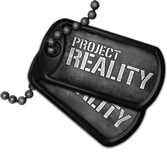

# Introduction

## 

## **Project Reality: BF2 Manual - Updated for v1.6.4**

> Project Reality: BF2 находится в разработке бесчисленных разработчиков в течение более чем 15 лет. За это время были внесены обширные модификации и улучшения. После тысяч изменений становится все труднее и труднее признать, что PR - это модификация Battlefield 2. Мы надеемся, что это руководство станет для вас хорошим началом в непростом мире PR: BF2.Если у вас есть какие-либо отзывы или вопросы, на которые нет ответа по поводу этого документа, не стесняйтесь обращаться к нам на форумах.
>
> _Команда PR_

**Introduction**

В этом введении дается краткий обзор того, что вы можете ожидать, когда начнете играть в модификацию Project Reality для Battlefield 2. Эта модификация имеет такой уровень сложности и командной работы, который вы не найдете в большинстве современных шутеров от первого лица. находит баланс между симуляцией и игровым процессом. Из-за большого объёма информации, который требует много времени для освоения мы настоятельно рекомендуем всем новым игрокам внимательно прочитать это руководство перед тем, как присоединиться к онлайн-игре.

The primary core ethos of Project Reality is teamwork. Coordination within your squad, between squads and throughout your team is paramount. The role of squad leader and the commander is essential to success in PR and the direction of the game is dictated by those in leadership positions and carried out by the players. PR:BF2 contains a multitude of gameplay mechanics which differentiate roles within a squad and the team. It also gives squad leaders and team commanders the ability to deploy emplacement assets such as foxholes, machine gun nests and mortar pits to fortify the defence of spawn locations known as FOBs. In addition, the role of players within a squad has been greatly diversified, and is reflected in an expanded selection of standard and limited specialty kits for various infantry load outs alongside unique kits for operating mechanized and aviation vehicles.

Another core fundamental aspect of PR is how players communicate. Communication in PR is an essential element of gameplay and we recommend that all players are microphone ready when they begin playing online. To ensure enhanced communication, an integrated version of PR Mumble voice communication software gives players abilities not available with built in BF2 voice-over-IP, such as the ability to talk to other players within the local vicinity, regardless of which squad they are in, as well as transmit to squad members over the squad radio no matter where they are on the battlefield. No additional installation is required, which means every player on the battlefield will have the same communications setup and can communicate effortlessly.

This mod was made by players, for players so don't be afraid to ask for help in-game or on the forums at [realitymod.com](https://www.realitymod.com/forum/forumdisplay.php?f=27). Again, welcome to PR and a totally new gaming experience!

